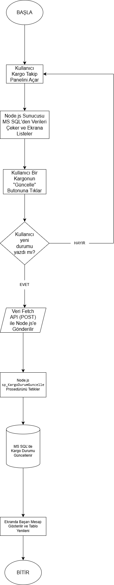

# 📦 Lojistik Otomasyonu Veritabanı Projesi

## 1. Problem Tanımı
Günümüzde lojistik firmalarının kargo kabul, araç atama ve sefer takip süreçlerini manuel veya birbirinden bağımsız sistemlerle yönetmesi; veri tutarsızlıklarına, kargo kayıplarına ve operasyonel gecikmelere yol açmaktadır. Bu proje kapsamında, kargo süreçlerinin uçtan uca izlenebildiği, müşteri ve sefer bilgilerinin güvenli bir şekilde saklandığı merkezi bir veritabanı otomasyonu eksikliği problemine çözüm getirilmesi hedeflenmiştir[cite: 1].

## 2. Yapılan Araştırmalar
Proje geliştirme aşamasında, veri tekrarını önlemek ve tutarlılığı sağlamak amacıyla veritabanı normalizasyon kuralları (5N) üzerine araştırmalar yapılmıştır[cite: 1]. MS SQL Server üzerinde performanslı veri çekimi için "View" ve "Index" yapıları incelenmiş; veri manipülasyonlarını güvenli hale getirmek için "Stored Procedure" ve otomatik loglama süreçleri için "Trigger" yapılarının entegrasyonu sağlanmıştır[cite: 1]. Ayrıca, veritabanının modern bir web arayüzü ile haberleşebilmesi için Node.js ve Fetch API teknolojilerinin kullanımı araştırılmıştır.

## 3. Akış Şeması
<!-- Proje klasörüne yüklediğiniz akış şeması görselinin adını aşağıdaki parantez içine yazınız -->
[cite: 1]

## 4. Yazılım Mimarisi
Proje, üç katmanlı bir mimari (Client-Server-Database) üzerine inşa edilmiştir[cite: 1]:
*   **Veritabanı Katmanı:** MS SQL Server kullanılarak ilişkisel tablolar, kısıtlayıcılar (Constraints) ve programlanabilir yapılar kurgulanmıştır[cite: 1].
*   **Arka Uç (Backend) Sunucu:** Node.js ve Express.js kullanılarak RESTful API mimarisi oluşturulmuş, veritabanı ile arayüz arasındaki iletişim sağlanmıştır.
*   **Ön Uç (Frontend) İstemci:** HTML5, CSS3 ve Vanilla JavaScript (Fetch API) kullanılarak asenkron veri çeken dinamik ve responsive bir kullanıcı arayüzü tasarlanmıştır.

## 5. Veri Tabanı Diyagramı
<!-- Veritabanından aldığınız ER diyagramı görselinin adını aşağıdaki parantez içine yazınız -->
[cite: 1]

## 6. Genel Yapı
Sistem; Müşteriler, Kargolar, Sürücüler, Araçlar, Seferler ve Sistem Logları olmak üzere birbiriyle ilişkili 6 temel tablodan oluşmaktadır. Her tablo, anlamlı test verileriyle doldurulmuş ve veri bütünlüğünü koruyacak Primary Key, Foreign Key, Unique ve Check kısıtlayıcıları ile donatılmıştır[cite: 1]. Kullanıcı dostu arayüz üzerinden kargo listeleri ve araç seferleri anlık olarak (View) izlenebilmekte, sistem üzerinden kargo durum güncellemeleri (Stored Procedure) yapılabilmektedir[cite: 1]. Sistemde yapılan değişiklikler anlık olarak loglanarak (Trigger) güvenlik ve izlenebilirlik maksimize edilmiştir[cite: 1].

## 7. Referanslar
*   Kocaeli Üniversitesi TBL331 Veritabanı Yönetim Sistemleri Ders Notları[cite: 1]
*   MS SQL Server Resmi Dokümantasyonu (T-SQL)[cite: 1]
*   Node.js ve Express.js Dokümantasyonları[cite: 1]
*   MDN Web Docs (JavaScript Fetch API)[cite: 1]
